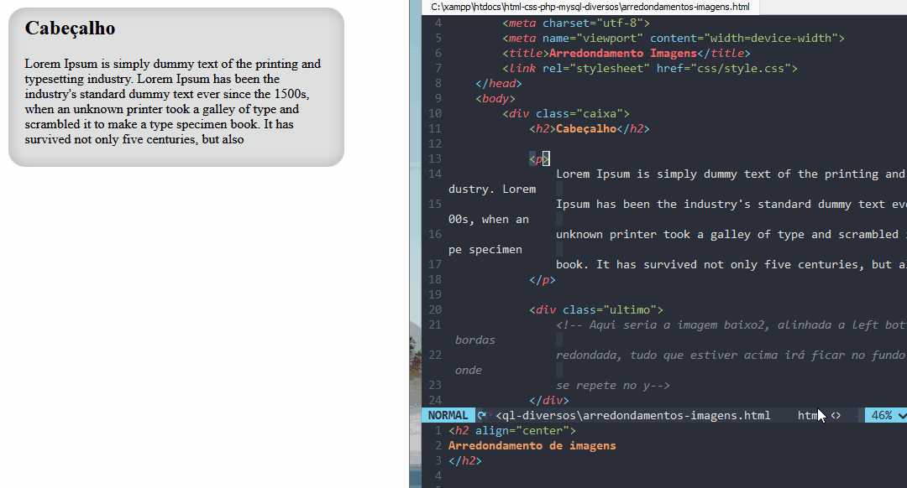

<h2 align="center">
Arredondamento de imagens
</h2>

Aqui iremos usar 3 imagens com suas bordas arredondadas, top, botoom
e center, apenas a imagem do centro onde está o seu conteúdo que irar se repetir(repeat-y).

<h1 align="center">

